# Pertemuan 4 - Aplikasi Pertama dan Widget Dasar Flutter

**Mata Kuliah : Pemrograman Mobile**  
**Nama        : Susilowati Syafa Adilah**  
**NIM         : 2341760095**  
**Kelas       : SIB 3F**  

---

## Praktikum 1: Membuat Project Flutter Baru  
- Membuat project Flutter pertama dengan struktur folder default.  
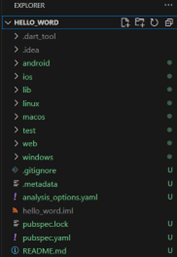
- Aplikasi berhasil dijalankan dengan pesan *"Your Flutter Project is ready!"*.  
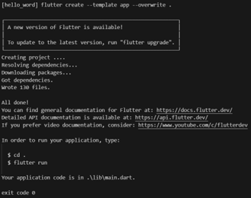

---

## Praktikum 2: Menghubungkan Perangkat Android atau Emulator  
- Menghubungkan perangkat Android melalui kabel USB atau menggunakan emulator.  
- Pada Android Studio, memilih Pair Devices Using Wi-Fi.  

- Melakukan pemindaian QR Code dari komputer ke perangkat Android.  
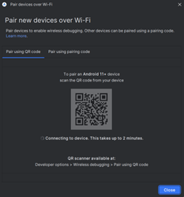
- Perangkat berhasil terhubung.  
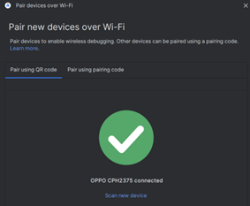

---

## Praktikum 3: Membuat Repository GitHub dan Laporan Praktikum  
- Membuat repository di GitHub.  
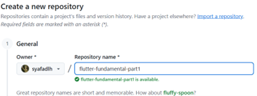
- Melakukan inisialisasi Git pada project Flutter.  
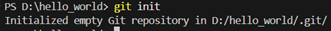
- Push project ke repository GitHub.  
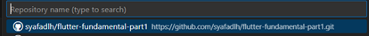
- Commit pertama berisi file .gitignore.  
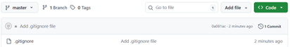
- Commit dan push file README.md.  
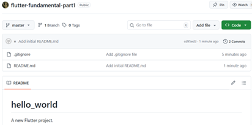
- Commit dan push seluruh file project.  
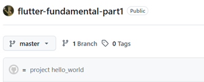
- Menjalankan aplikasi Flutter.  
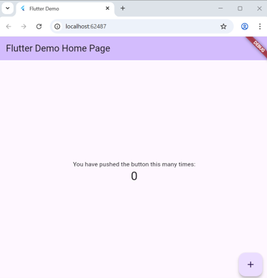
- Melakukan modifikasi teks pada aplikasi.  
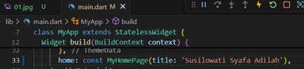
- Menampilkan hasil akhir aplikasi.  
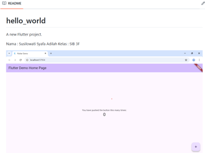

---

## Praktikum 4: Menerapkan Widget Dasar  
 
- Menampilkan teks sederhana di layar.  

- Menampilkan gambar dari aset aplikasi.  

---

## Praktikum 5: Menerapkan Widget Material Design dan iOS Cupertino  

- Menambahkan tombol gaya iOS dan indikator loading.  

- Menampilkan Floating Action Button (FAB)  

- Menyusun Scaffold Widget  

- Menampilkan dialog pop-up untuk interaksi pengguna.  

- Menyediakan form input dan opsi pemilihan.  

- Memungkinkan pengguna memilih tanggal dan waktu.  

---
