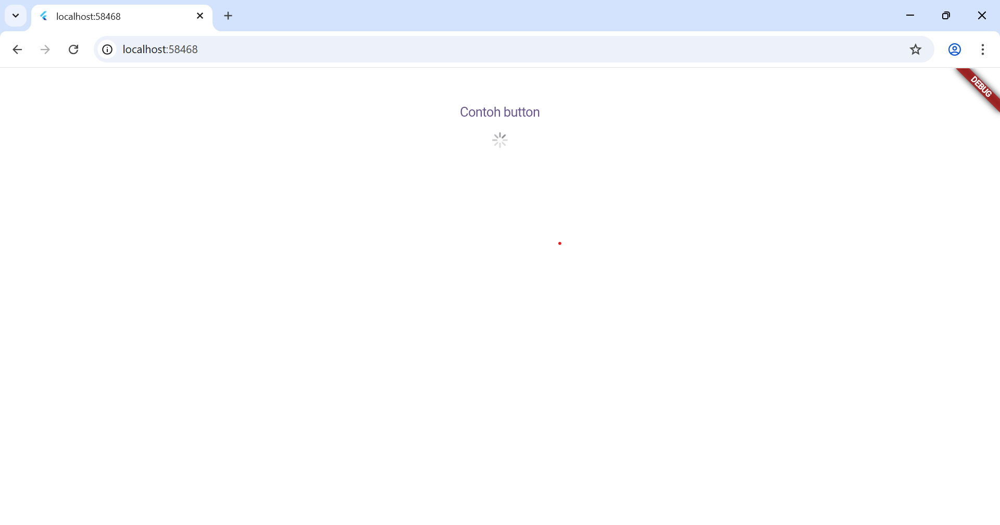

# hello_world

A new Flutter project.

Nama : Susilowati Syafa Adilah
Kelas : SIB 3F

Praktikum 3

Praktikum 4 - Text Widget

Praktikum 4 - Image Widget

Praktikum 5 - Cupertino Button dan Loading Bar

Praktikum 5 - Floating Action Button (FAB)

Praktikum 5 - Scaffold Widget

Praktikum 5 - Dialog Widget

Praktikum 5 - Input dan Selection Widget

Praktikum 5 - Date and Time Pickers
