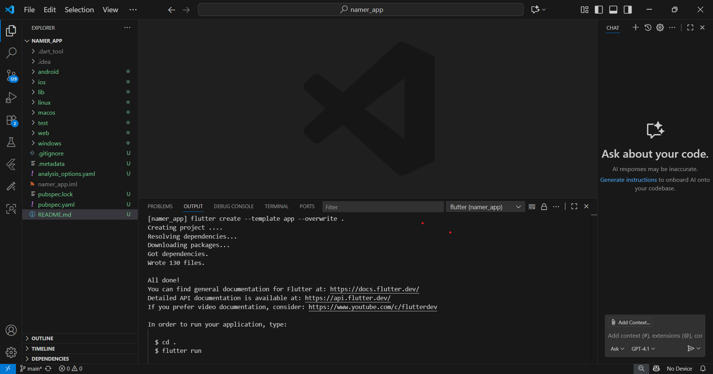

# Namer App

**Mata Kuliah : Pemrograman Mobile**  
**Nama        : Susilowati Syafa Adilah**  
**NIM         : 2341760095**  
**Kelas       : SIB 3F**  

---

## Langkah Praktikum

### 1. Membuat Proyek
- Buat project Flutter baru dengan nama namer_app.  
  
- Mengubah File pubspec.yaml
- Mengubah File analysis_options.yaml
- Hasil Praktikum
 

---

### 2. Menambahkan Tombol
- Hot reload pertama
 
- Menambahkan tombol
 
- Menambahkan perilaku getNext()
- Menghubungkan tombol dengan state
- Hasil Praktikum
 

---

