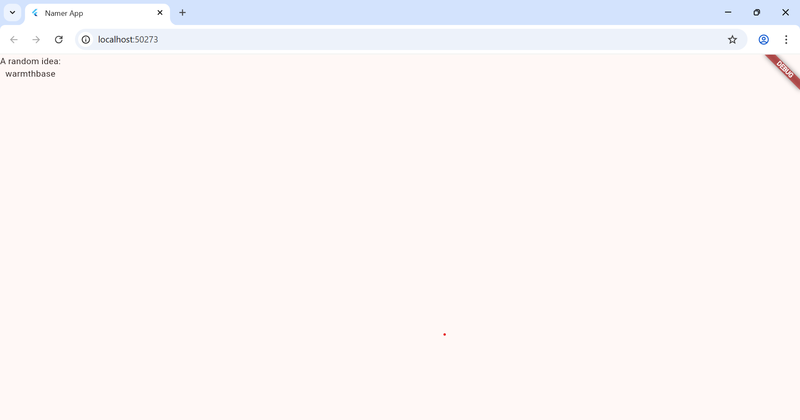
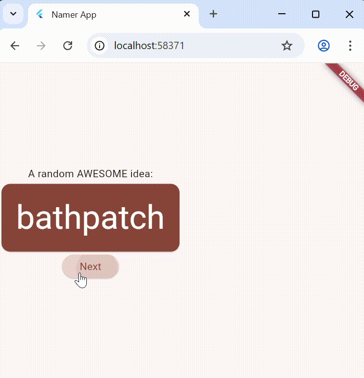
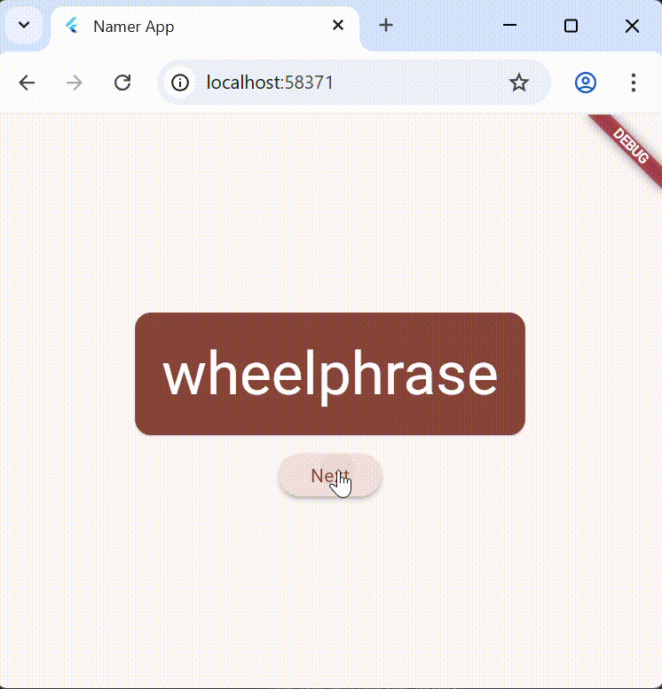

# Namer App

**Mata Kuliah : Pemrograman Mobile**  
**Nama        : Susilowati Syafa Adilah**  
**NIM         : 2341760095**  
**Kelas       : SIB 3F**  

---

## Langkah Praktikum

### 1. Membuat Proyek
- Buat project Flutter baru dengan nama namer_app.  
  
- Mengubah File pubspec.yaml
- Mengubah File analysis_options.yaml
- Hasil Praktikum
 

---

### 2. Menambahkan Tombol
- Hot reload pertama

 

- Menambahkan tombol

 

- Menambahkan perilaku getNext()
- Menghubungkan tombol dengan state
- Hasil Praktikum

 

---

### 3. Memperindah Tampilan Aplikasi
- Mengekstrak Widget

 

- Membungkus dengan Padding dan Card

 

- Menambahkan Warna dari Theme

- Mengubah Gaya Teks (TextTheme)

- Meningkatkan Aksesibilitas

- Menempatkan UI di Tengah

- Hasil Praktikum

---

### 4. Menambahkan Fungsi “Like”
- Menambahkan logika bisnis

- Membungkus tombol Next dengan Row

- Menambahkan tombol Like

- Tampilan akhir UI setelah penambahan tombol Like

---

### 5. Menambahkan Kolom Samping Navigasi
- Memisahkan MyHomePage menjadi GeneratorPage

- Mengubah MyHomePage menjadi StatefulWidget

- Menambahkan selectedIndex & setState

- Menentukan halaman sesuai selectedIndex

- Membuat NavigationRail responsif
NavigationRail responsif saat memperbesar/memperkecil jendela

---