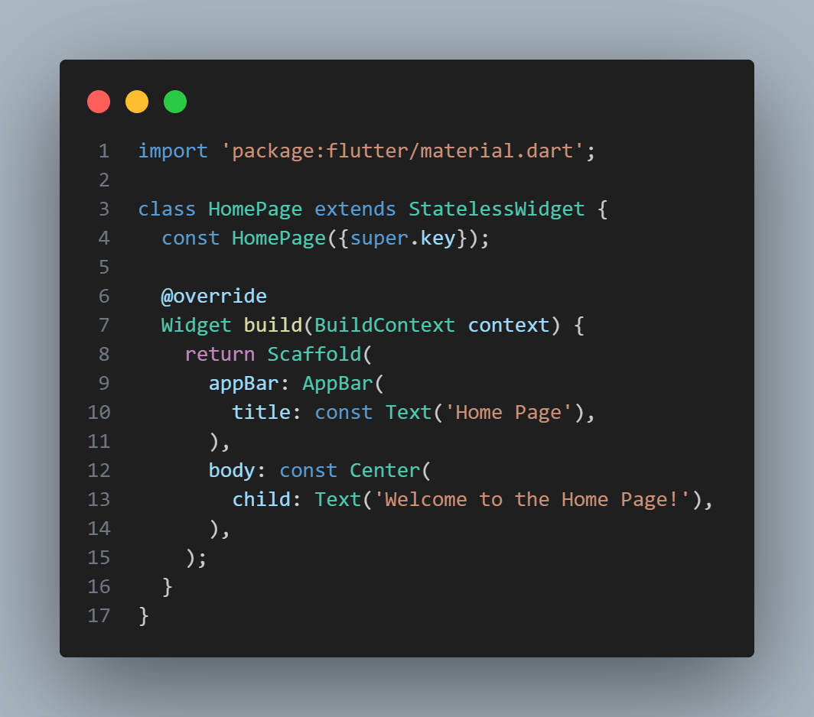

# Pertemuan 5 - Layout dan Navigasi

**Mata Kuliah : Pemrograman Mobile**  
**Nama        : Susilowati Syafa Adilah**  
**NIM         : 2341760095**  
**Kelas       : SIB 3F**  

---

## Praktikum 5: Membangun Navigasi di Flutter

**Langkah 1: Siapkan Project Baru**
1. Buat project Flutter baru dengan nama 'belanja'
2. Struktur folder yang dianjurkan:

**Langkah 2: Mendefinisikan Route**
1. Buat dua file di folder pages:
    - home_page.dart → class HomePage extends StatelessWidget

    

    - item_page.dart → class ItemPage extends StatelessWidget

    

**Langkah 3: Lengkapi Kode di main.dart**

**Langkah 4: Membuat data model**
1. Buat file models/item.dart dengan class Item:

