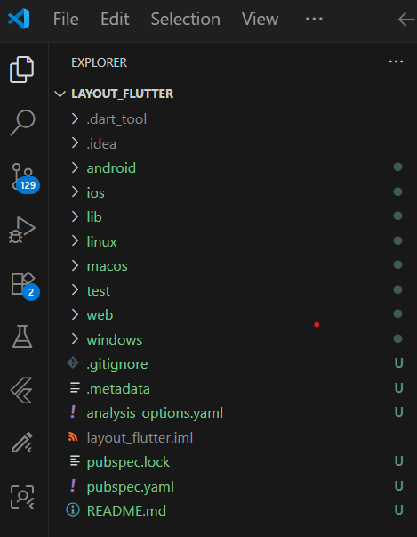

# Pertemuan 5 - Layout dan Navigasi

**Mata Kuliah : Pemrograman Mobile**  
**Nama        : Susilowati Syafa Adilah**  
**NIM         : 2341760095**  
**Kelas       : SIB 3F**  

---

## Praktikum 1: Membangun Layout di Flutter

**Langkah 1: Membuat Project Baru**
Buat project Flutter baru di **VS Code** dengan nama `layout_flutter`.

**Langkah 2: Membuka dan Mengedit File `main.dart`**
1. Buka file `lib/main.dart`.
2. Ganti seluruh isi file dengan kode berikut, lalu sesuaikan nama dan NIM Anda:

**Langkah 3: Identifikasi Layout**
1. Perhatikan desain UI akhir: terdiri dari gambar, judul (title row), tombol (button row), dan teks deskripsi.
2. Bagian judul memiliki 3 elemen utama dalam 1 baris:
    - Kolom teks (judul wisata dan lokasi).
    - Ikon bintang merah.
    - Angka penilaian.
3. Setiap kolom atau baris dapat ditata menggunakan Row, Column, Expanded, dan Container.

**Langkah 4: Membuat Title Row**
Tambahkan kode di dalam metode build() (sebelum return MaterialApp).

Maka hasil outputnya:

---

## Praktikum 2: Implementasi Button Row
**Langkah 1: Buat method _buildButtonColumn**
Tambahkan method _buildButtonColumn(Color color, IconData icon, String label) di dalam class MyApp (di luar build())

*Method `_buildButtonColumn` disiapkan untuk membuat ikon + teks dalam baris tombol yang rapi.*

**Langkah 2: Buat widget buttonSection**
1. Di dalam build(), ambil warna utama.
2. Buat Row dengan 3 kolom menggunakan _buildButtonColumn() untuk CALL, ROUTE, SHARE.

**Langkah 3: Tambahkan buttonSection ke body**
Tambahkan buttonSection ke widget Column utama di body:

Maka hasil outputnya:

