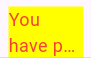
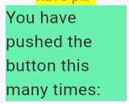
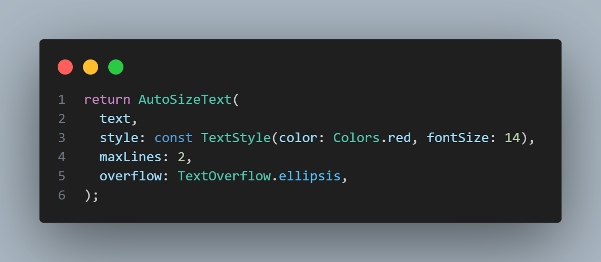

# Pertemuan 6 - Manajemen Plugin

**Mata Kuliah : Pemrograman Mobile**  
**Nama        : Susilowati Syafa Adilah**  
**NIM         : 2341760095**  
**Kelas       : SIB 3F**  

---

## Praktikum: Menerapkan Plugin di Project Flutter

**Langkah 1: Buat Project Baru**
1. Buat project Flutter baru di **VS Code** dengan nama `flutter_plugin_pubdev`.

**Langkah 2: Menambahkan Plugin**
1. Tambahkan Plugin dari pub.dev
    - Jalankan di terminal:

    

    - Setelah berhasil, di pubspec.yaml bagian dependencies akan muncul:

    

**Langkah 3: Buat file red_text_widget.dart**
1. Di dalam folder lib, buat file baru:

2. Isi awal kodenya:

**Langkah 4: Tambah Widget AutoSizeText**
1. Edit file red_text_widget.dart menjadi:

Mendapatkan info error akan muncul error "Undefined name 'text'" karena variabel text belum dideklarasikan di kelas RedTextWidget.

**Langkah 5: Buat Variabel text dan parameter di constructor**
1. Tambahkan variabel text dan parameter di constructor seperti berikut:

**Langkah 6: Tambahkan widget di main.dart**
1. Edit lib/main.dart, cari bagian children: di dalam _MyHomePageState, tambahkan kode berikut:

2. Jalankan Aplikasi

---

## Tugas Praktikum
**1. Selesaikan Praktikum tersebut, lalu dokumentasikan dan push ke repository Anda berupa screenshot hasil pekerjaan beserta penjelasannya di file README.md!**

**2. Jelaskan maksud dari langkah 2 pada praktikum tersebut!**
    Menambahkan plugin auto_size_text ke dalam proyek Flutter. Plugin ini digunakan agar teks bisa menyesuaikan ukuran otomatis supaya tidak kepanjangan atau keluar dari tampilan.

**3. Jelaskan maksud dari langkah 5 pada praktikum tersebut!**
    Membuat variabel text di RedTextWidget supaya widget bisa menampilkan teks berbeda. Parameter di constructor required this.text membuat kita harus memberikan teks saat memanggil widget, sehingga widget bisa digunakan ulang.

**4. Pada langkah 6 terdapat dua widget yang ditambahkan, jelaskan fungsi dan perbedaannya!**

    - RedTextWidget (kuning): Widget custom menggunakan plugin AutoSizeText. Teks akan menyesuaikan ukuran      otomatis agar muat di dalam container kecil.

    - Text (hijau): Widget bawaan Flutter. Teks ukuran tetap dan bisa terpotong jika container terlalu kecil.

**5. Jelaskan maksud dari tiap parameter yang ada di dalam plugin auto_size_text berdasarkan tautan pada dokumentasi ini !**

    - text: teks yang ingin ditampilkan pada widget. Di sini nilainya berasal dari variabel text yang dikirim ke widget RedTextWidget.
    - style: menentukan gaya teks, seperti warna dan ukuran font. Dalam contoh ini, teks berwarna merah (color: Colors.red) dan ukuran awal font 14.
    - maxLines: menetapkan jumlah maksimal baris teks yang ditampilkan. Jika teks lebih panjang dari batas ini, maka akan dipotong atau disesuaikan ukurannya agar muat. Di sini maksimal 2 baris.
    - overflow: mengatur cara menampilkan teks yang melebihi batas baris. TextOverflow.ellipsis artinya jika teks terlalu panjang, akan digantikan dengan tanda “…”.

