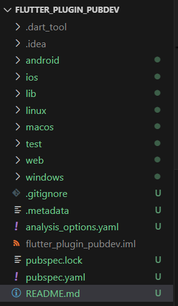
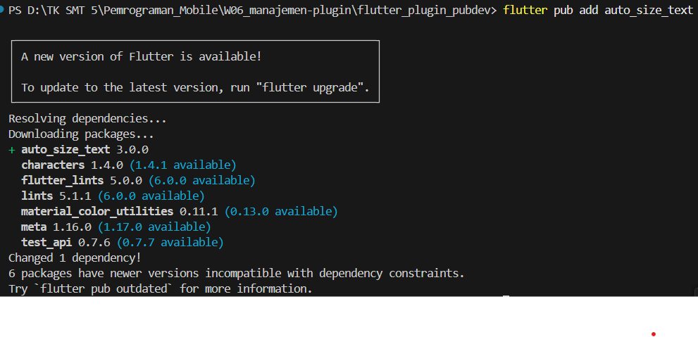
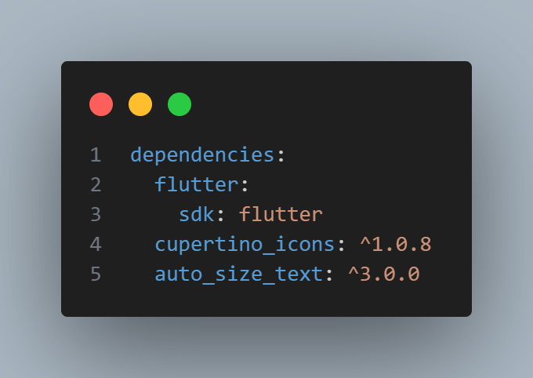
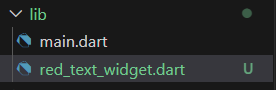
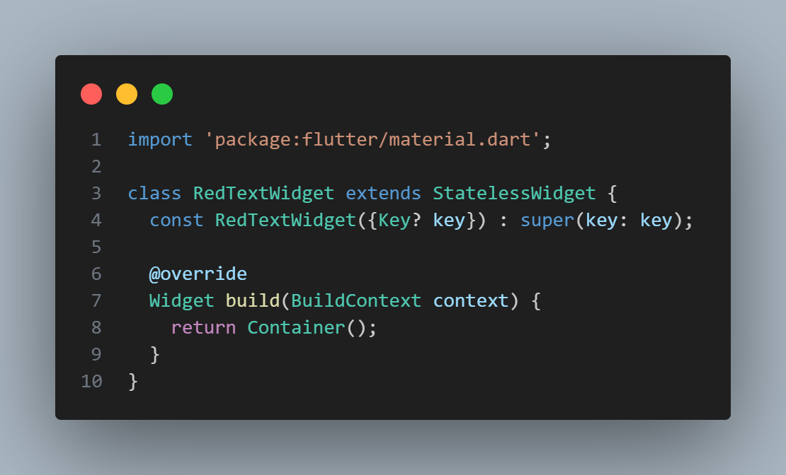
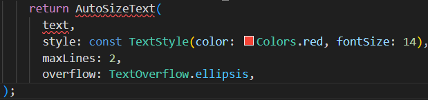
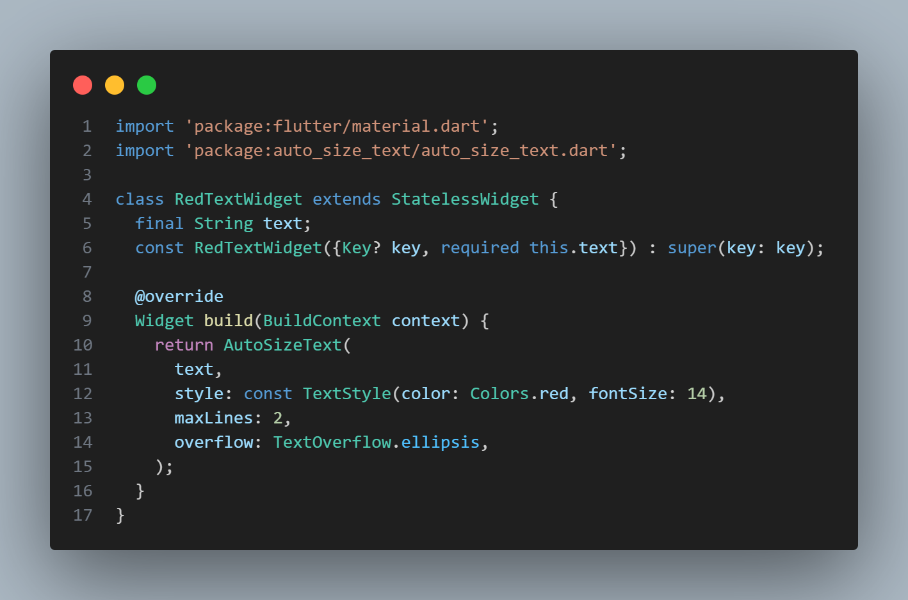
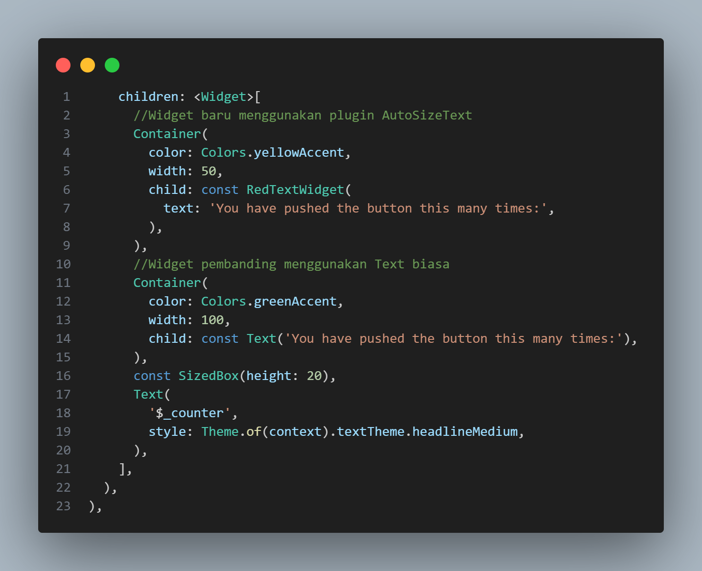
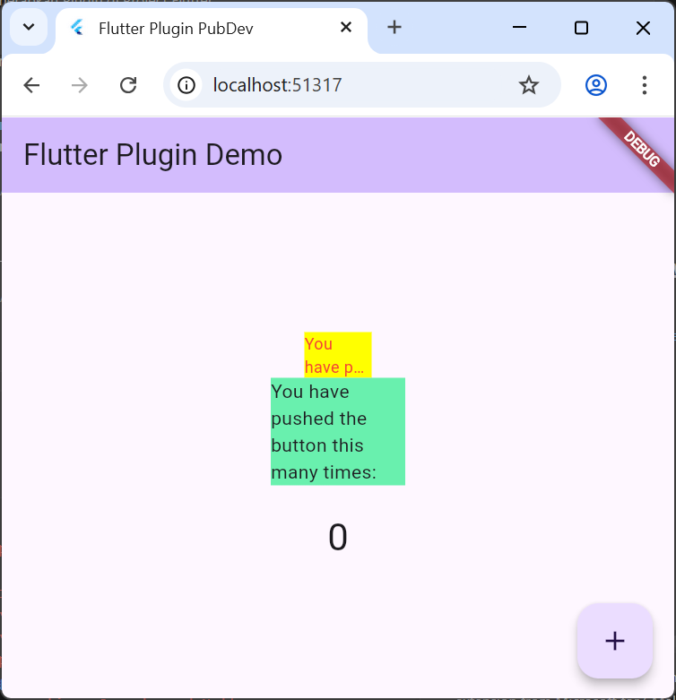

# Pertemuan 6 - Manajemen Plugin

**Mata Kuliah : Pemrograman Mobile**  
**Nama        : Susilowati Syafa Adilah**  
**NIM         : 2341760095**  
**Kelas       : SIB 3F**  

---

## Praktikum: Menerapkan Plugin di Project Flutter

**Langkah 1: Buat Project Baru**
1. Buat project Flutter baru di **VS Code** dengan nama `flutter_plugin_pubdev`.

**Langkah 2: Menambahkan Plugin**
1. Tambahkan Plugin dari pub.dev
    - Jalankan di terminal:

    

    - Setelah berhasil, di pubspec.yaml bagian dependencies akan muncul:

    

**Langkah 3: Buat file red_text_widget.dart**
1. Di dalam folder lib, buat file baru:

2. Isi awal kodenya:

**Langkah 4: Tambah Widget AutoSizeText**
1. Edit file red_text_widget.dart menjadi:

Mendapatkan info error akan muncul error "Undefined name 'text'" karena variabel text belum dideklarasikan di kelas RedTextWidget.

**Langkah 5: Buat Variabel text dan parameter di constructor**
1. Tambahkan variabel text dan parameter di constructor seperti berikut:

**Langkah 6: Tambahkan widget di main.dart**
1. Edit lib/main.dart, cari bagian children: di dalam _MyHomePageState, tambahkan kode berikut:

2. Jalankan Aplikasi

