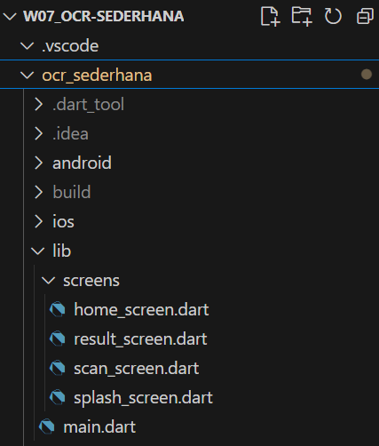
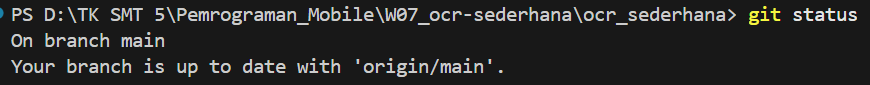
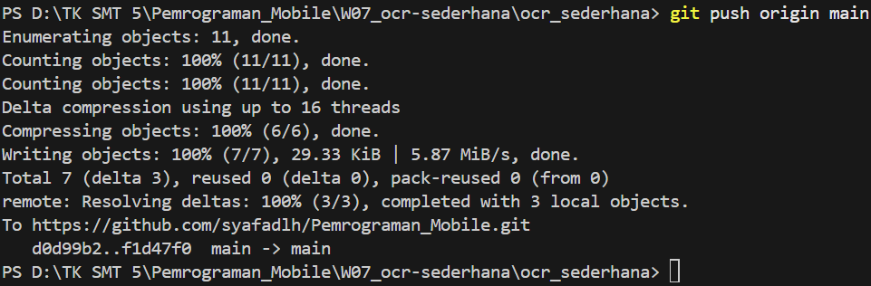
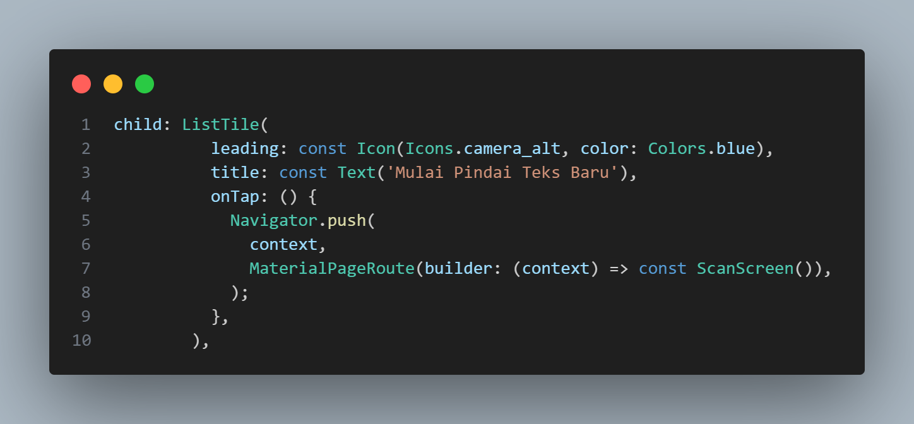
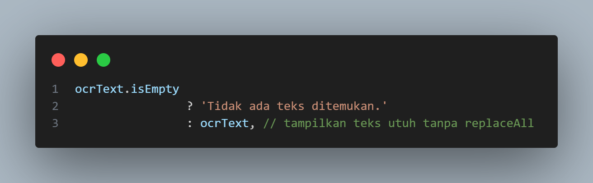
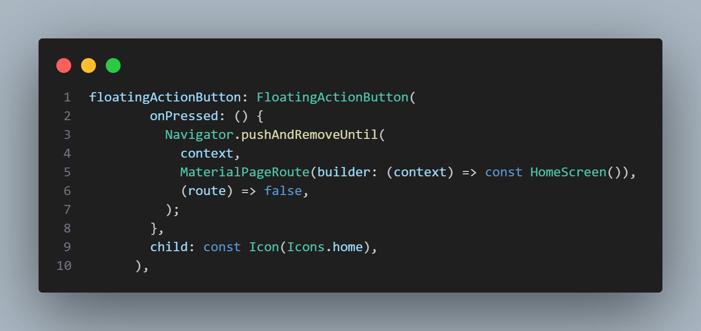
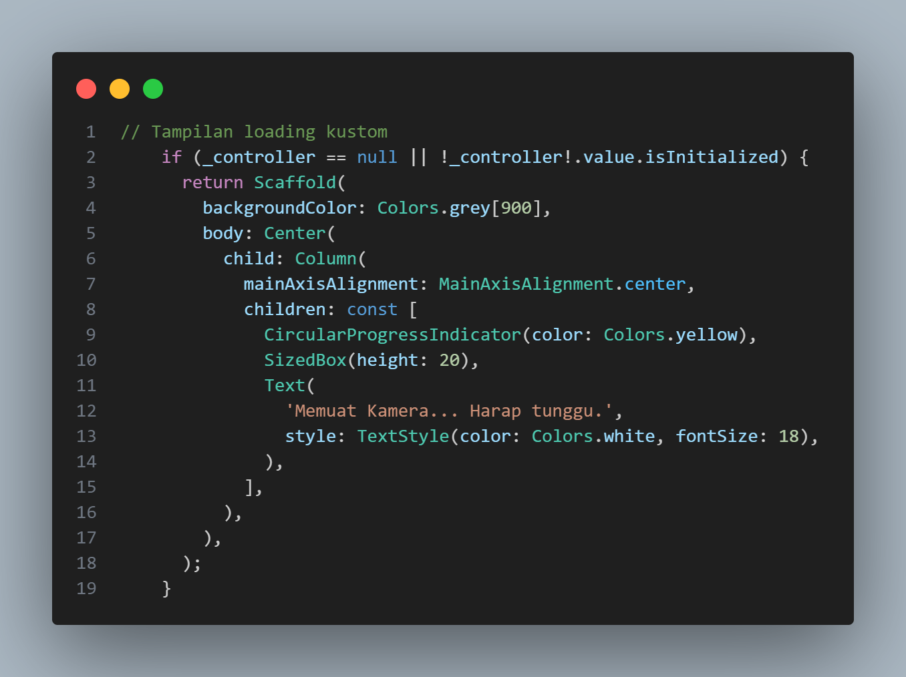
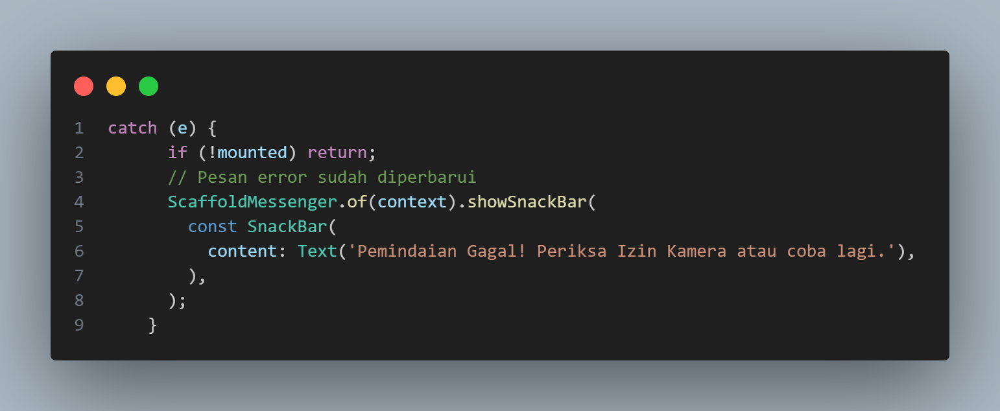
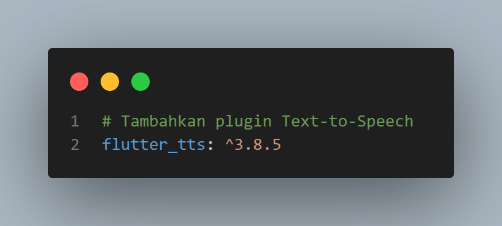

# Pertemuan 8 - Ujian Tengah Semester

**Mata Kuliah : Pemrograman Mobile**  
**Nama        : Susilowati Syafa Adilah**  
**NIM         : 2341760095**  
**Kelas       : SIB 3F**  

---

## INSTRUKSI AWAL (SETUP)

1. Buka proyek Flutter:

2. Cek repositori Git:

3. Commit awal:

---

## SOAL 1 – Modifikasi Navigasi & Alur

1. Buka file: lib/screens/home_screen.dart
2. Ubah tombol lama menjadi ListTile:

3. Buka file: lib/screens/result_screen.dart
4. Tampilkan teks utuh:

5. Tambah tombol FloatingActionButton untuk kembali ke Home:

---

## SOAL 2 – Tampilan Loading & Error Handling

1. Buka file: lib/screens/scan_screen.dart
2. Modifikasi tampilan loading (saat kamera belum siap):

3. Perbarui pesan error pada catch (e):

---

## SOAL 3 – Implementasi Text-to-Speech (TTS)

1. Tambahkan plugin di pubspec.yaml:

2. Ubah ResultScreen menjadi StatefulWidget:

